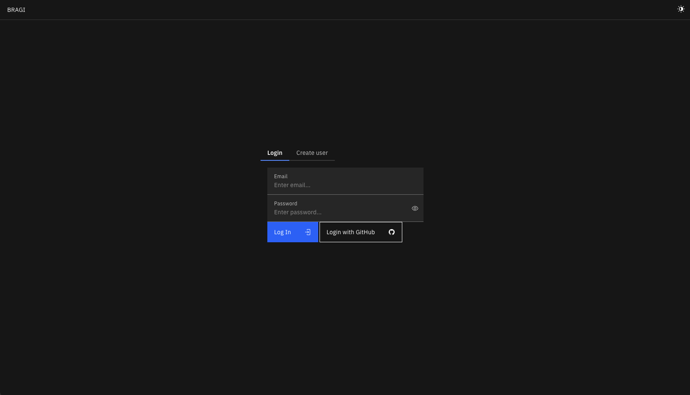
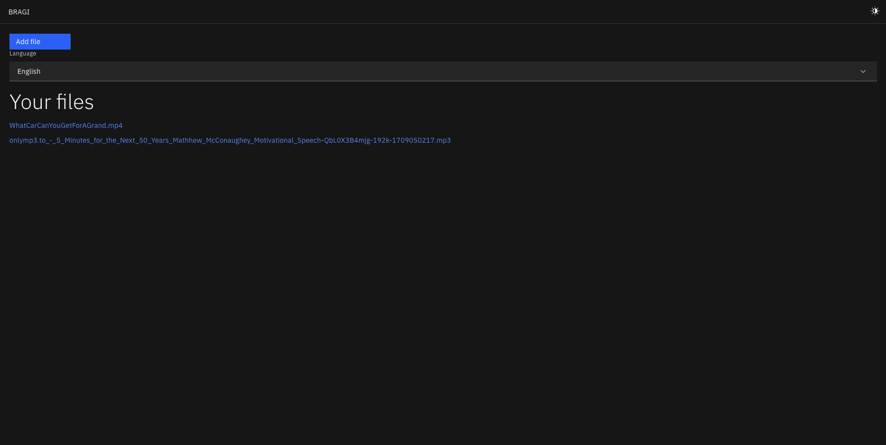
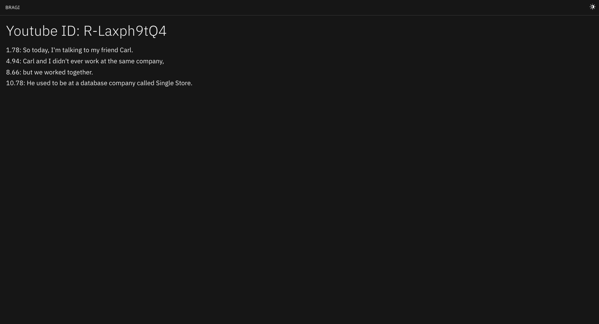
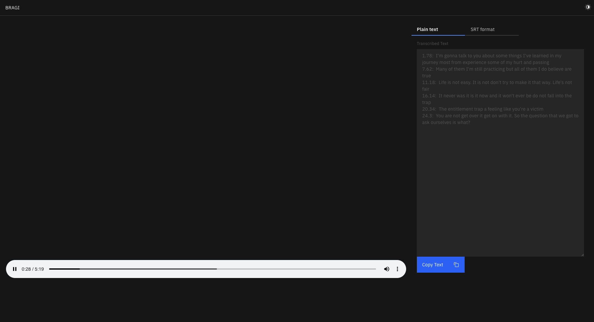
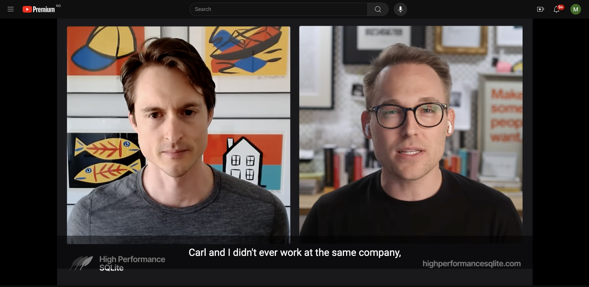

# Bragi

Bragi is a web service to automatically transcribe either YouTube videos or custom audio or video files.

### Running the app
#### Requirements

* Python 3.12
* Poetry
* Node.js v20 + npm

#### Backend
```
mkdir -p /tmp/bragi/data
cd api
poetry install
poetry run python3 -m bragi_api.__main__ --sqlite-path /tmp/bragi/sqlite.db --data-dir /tmp/bragi/data
```

#### Frontend
```
cd frontend
npm install
npm run dev
```

#### Extension
```
cd bragi-chrome
npm install
npm run build
# Install extension in chrome://extensions with developer mode enabled
```

### Screenshots









